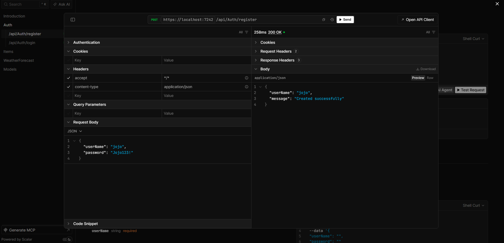
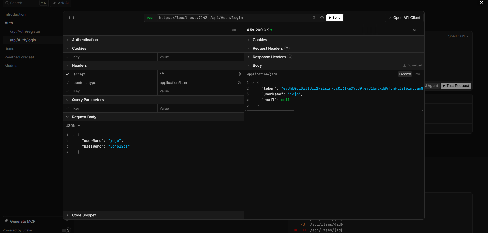
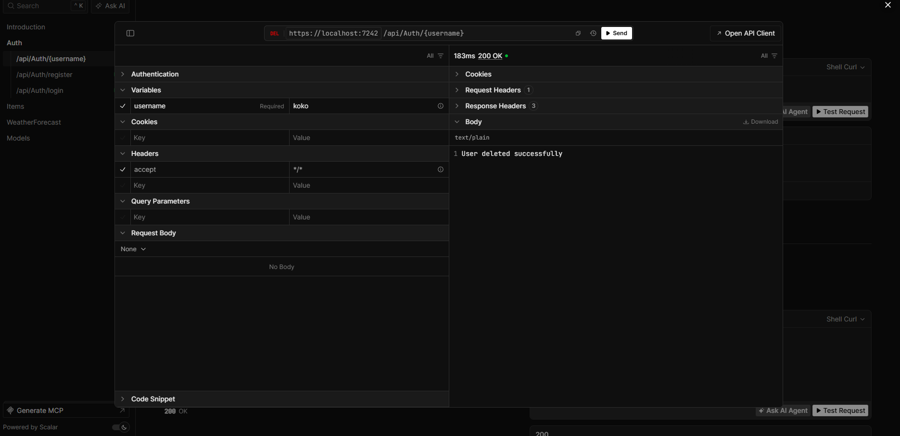
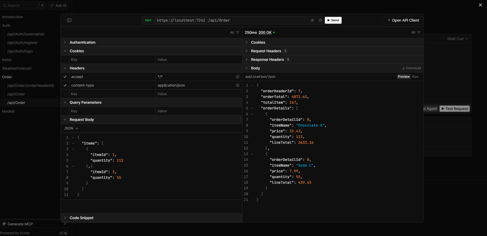
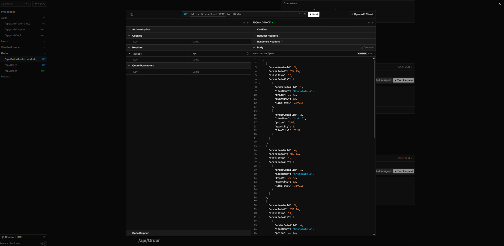
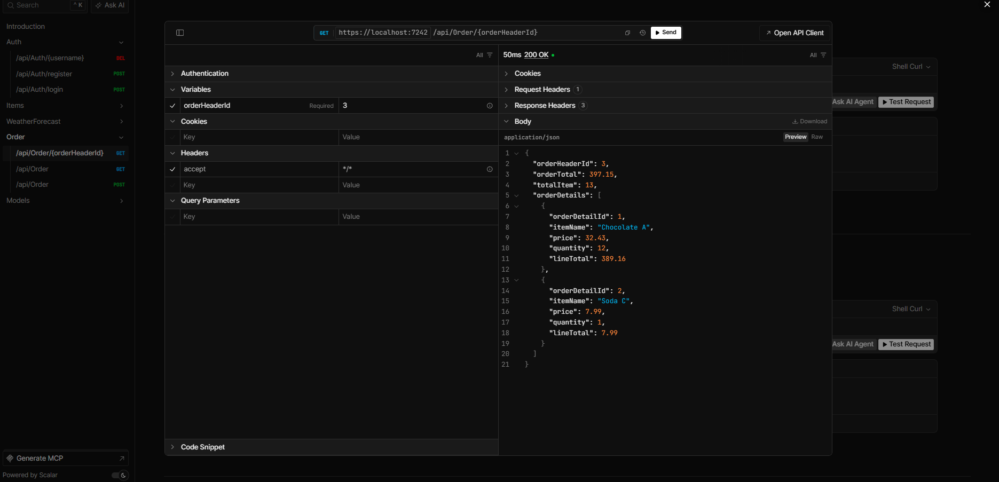

## .NET Identity 
- Register user with username & password

- Login user with username & password and generate JWT token

- Delete user with username

- Create order with ItemId and quantity

- Get all orders

- Get single order with HeaderOrderId
